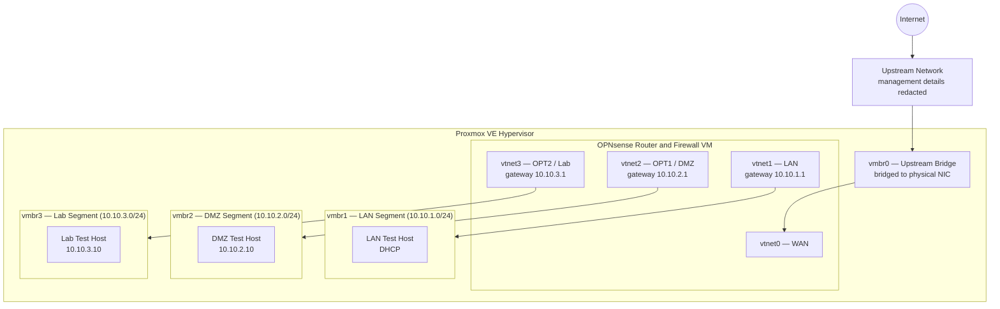

# Project 1: OPNsense Network Segmentation


## Overview

Designed and implemented a segmented lab network on a Proxmox hypervisor using OPNsense as the router and firewall. Three isolated network segments were created — LAN, DMZ, and Lab — each with its own Linux container as a host. Firewall rules enforce strict isolation between segments while allowing all segments to reach the internet.

This lab demonstrates enterprise-relevant concepts including trust-zone segmentation, routed policy enforcement, controlled access, and repeatable validation. Cloud platforms implement comparable concepts through managed networking services, although the architecture and responsibility model differ.

---

## Goals

- Create isolated network segments for different trust levels
- Route traffic between segments through a firewall (not a flat switch)
- Prove isolation: DMZ and Lab cannot reach the LAN
- Prove controlled access: all segments can reach the internet
- Build a foundation for future IDS/IPS and SIEM projects

---

## Architecture



---

## Tech Stack

| Component | Version | Role |
|---|---|---|
| Proxmox VE | 9.1.1 | Hypervisor |
| OPNsense | 26.1.6_2 (amd64) | Router / Firewall |
| Debian LXC | — | Segment target hosts |

---

## Network Design

| Segment | Bridge | Subnet | Gateway | Trust Level |
|---|---|---|---|---|
| Upstream | vmbr0 | Redacted | Upstream gateway | External |
| LAN | vmbr1 | 10.10.1.0/24 | 10.10.1.1 | Trusted |
| DMZ | vmbr2 | 10.10.2.0/24 | 10.10.2.1 | Semi-trusted |
| Lab | vmbr3 | 10.10.3.0/24 | 10.10.3.1 | Untrusted |

### Why three segments?

**LAN** is the trusted zone — production services and management traffic live here. Nothing from DMZ or Lab should ever reach it.

**DMZ** (Demilitarized Zone) is for services that need internet access but shouldn't touch the LAN. In a real network this is where public-facing web servers live. Here it's a staging zone for future projects.

**Lab** is the untrusted zone for attack/defense exercises. Kali Linux will run here. It is the most restricted — blocked from both LAN and DMZ.

The trust-zone model is conceptually similar to separating public, private, and isolated workloads in a cloud environment, but cloud routing, security groups, network ACLs, and managed gateways divide responsibilities differently from this single-firewall design.

---

## Implementation

### Step 1 — Create Proxmox bridges

Four bridges were configured in `/etc/network/interfaces` on the Proxmox host:

- **vmbr0** — bridged to the physical NIC and connected to the upstream network
- **vmbr1, vmbr2, vmbr3** — internal-only bridges with no physical port (`bridge-ports none`)

Internal bridges have no physical attachment — they are virtual switches that only carry traffic between VMs and containers on the Proxmox host. OPNsense is the only entity with a leg in all four, making it the sole routing and filtering point.

### Step 2 — Deploy OPNsense VM

The OPNsense VM was created with four virtual NICs, one per bridge:

| NIC | Bridge | OPNsense Interface | Role |
|---|---|---|---|
| net0 (virtio) | vmbr0 | vtnet0 / WAN | Uplink to upstream network |
| net1 (virtio) | vmbr1 | vtnet1 / LAN | Trusted segment |
| net2 (virtio) | vmbr2 | vtnet2 / OPT1 | DMZ segment |
| net3 (virtio) | vmbr3 | vtnet3 / OPT2 | Lab segment |

OPNsense was installed from ISO and interfaces were assigned through the console menu. Each interface was given a static gateway IP (the `.1` address of its subnet).

### Step 3 — Configure firewall rules

OPNsense firewall rules are applied **inbound on each interface** (traffic entering OPNsense from that segment):

**LAN (vtnet1):** allow all — this is the trusted zone.

**DMZ / OPT1 (vtnet2):**
- Block traffic destined for the LAN subnet (10.10.1.0/24)
- Allow all other traffic (internet access passes through)

**Lab / OPT2 (vtnet3):**
- Block traffic destined for the LAN subnet (10.10.1.0/24)
- Block traffic destined for the DMZ subnet (10.10.2.0/24)
- Allow all other traffic (internet access passes through)

### Step 4 — Deploy LXC containers

Three Debian LXC containers were created as target hosts, one per segment:

| Test Host | Bridge | IP Configuration |
|---|---|---|
| LAN host | vmbr1 | DHCP assigned by OPNsense |
| DMZ host | vmbr2 | Static address in the DMZ subnet |
| Lab host | vmbr3 | Static address in the Lab subnet |

Static IPs are set directly in the Proxmox container config (`pct config`) so they survive reboots without depending on DHCP.

---

## Isolation Verification

Tests were initiated from the Proxmox host using `pct exec` to run commands inside the isolated test containers. Container IDs shown below are local lab identifiers and are not management endpoints.

### Blocked traffic (expected: 100% packet loss)

```bash
# DMZ cannot reach LAN gateway
pct exec 201 -- ping -c 2 -W 2 10.10.1.1
# 2 packets transmitted, 0 received, 100% packet loss ✓

# Lab cannot reach LAN gateway
pct exec 202 -- ping -c 2 -W 2 10.10.1.1
# 2 packets transmitted, 0 received, 100% packet loss ✓

# Lab cannot reach DMZ host
pct exec 202 -- ping -c 2 -W 2 10.10.2.10
# 2 packets transmitted, 0 received, 100% packet loss ✓
```

### Allowed traffic (expected: internet reachable)

```bash
# DMZ can reach internet
pct exec 201 -- ping -c 2 8.8.8.8
# 2 packets transmitted, 2 received, 0% packet loss ✓

# Lab can reach internet
pct exec 202 -- ping -c 2 8.8.8.8
# 2 packets transmitted, 2 received, 0% packet loss ✓
```

All five tests passed. Segment isolation is confirmed.

---

## Key Concepts Learned

- **Virtual switches vs routed networks** — bridges are layer 2 (like a physical switch); routing between them requires a layer 3 device (OPNsense)
- **Stateful firewall rules** — OPNsense tracks connection state, so return traffic is automatically allowed without explicit rules
- **Inbound rule direction** — rules are written from the perspective of traffic *entering* an interface, not leaving
- **Defense in depth** — layering multiple enforcement points (segment isolation + firewall rules) means no single misconfiguration exposes everything
- **Cloud comparison** — the lab demonstrates transferable concepts such as subnet separation, routing, policy enforcement, and workload isolation, while managed cloud platforms divide those functions across multiple services

---

## Operational Relevance

This project provides evidence for:

- Diagnosing reachability and routing failures
- Verifying firewall behavior with controlled tests
- Separating expected blocking from genuine service failure
- Explaining network behavior to technical and nontechnical stakeholders
- Documenting implementation, evidence, and validation clearly

---

**Completed:** June 2026
