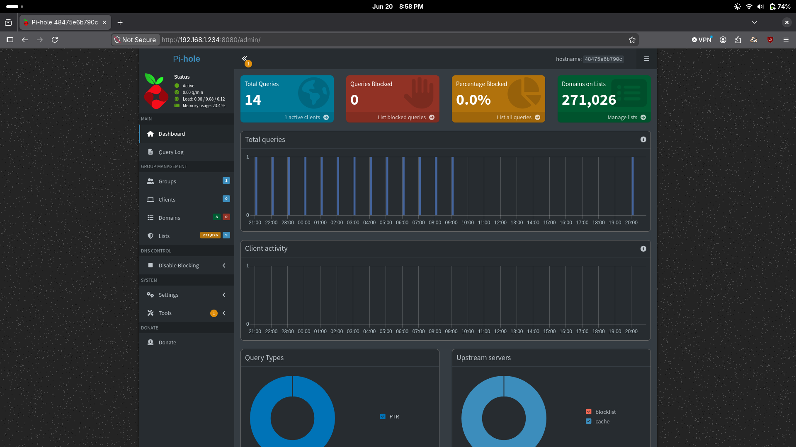
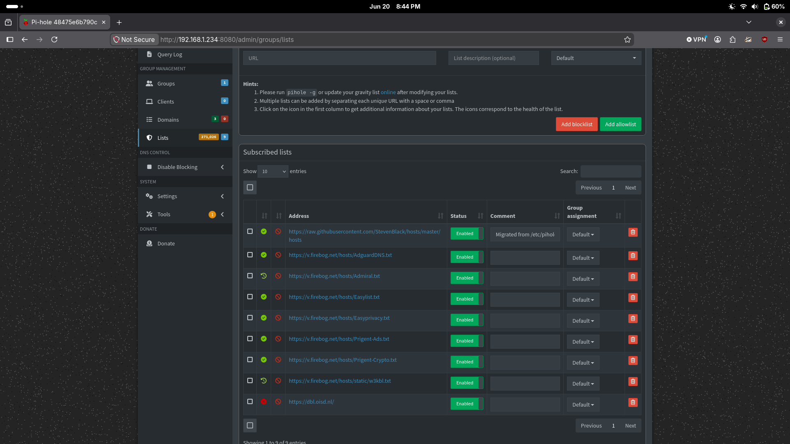
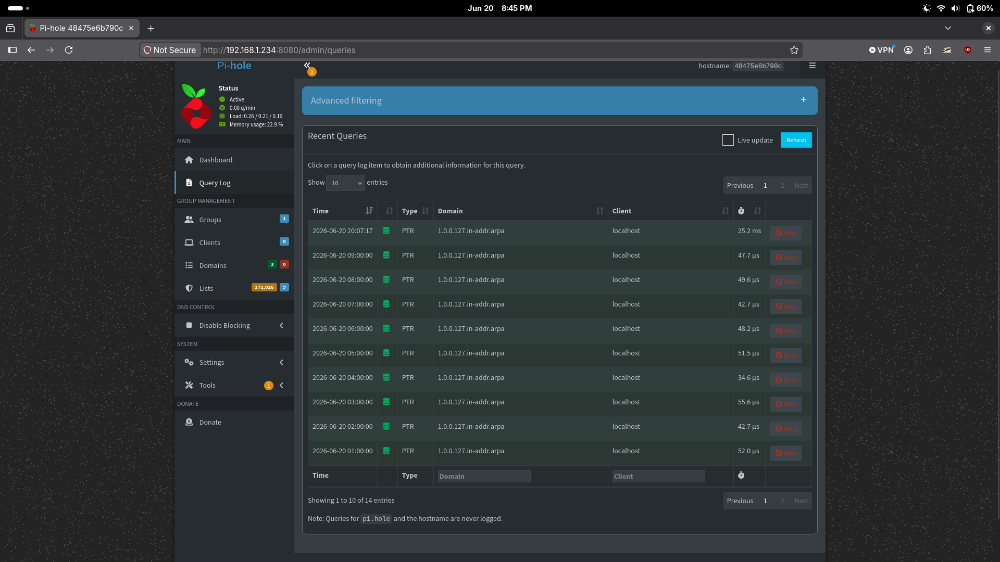

# Project 2: Pi-hole DNS


## Overview

Deployed Pi-hole as a network-wide DNS sinkhole running in Docker on the Carlvis VM. Pi-hole intercepts DNS queries from devices on the home network and blocks requests that match known ad, tracking, and malicious domain lists — before the browser ever makes a connection.

---

## Goals

- Block ads and tracking domains network-wide at the DNS layer
- Add threat intelligence feeds (crypto mining, malicious domains)
- Understand how DNS works as a security control point
- Practice Docker deployment and persistent container configuration
- Practice support-style DNS validation using query logs, direct lookups, and blocked vs allowed domain tests

---

## Support / Technical Support Relevance

This project demonstrates common DNS troubleshooting tasks used in Technical Support, Application Support, Web Hosting Support, NOC, and Cloud Support roles:

- Validating that a DNS service is running and listening on the correct port
- Testing name resolution directly against a known DNS server
- Comparing blocked vs allowed domain behavior
- Reviewing query logs to confirm client activity
- Identifying broken or deprecated blocklist sources
- Documenting repeatable DNS troubleshooting commands

---

## Tech Stack

| Component | Version | Role |
|---|---|---|
| Docker | — | Container runtime |
| Pi-hole | v6.4 | DNS server / ad blocker |
| Carlvis-Ubuntu | VM 100 | Host — `192.168.1.234` |

---

## Screenshots


*Dashboard showing active status, total queries, and 271,026 domains on blocklists*


*Subscribed blocklists — multiple threat intelligence feeds merged into the gravity database*


*Live DNS query log showing real-time lookups from network clients*

---

## How Pi-hole Works

Every device on a network needs DNS to browse the internet — it translates human-readable names like `google.com` into IP addresses. Normally your router handles this by forwarding queries to your ISP or a public resolver like `8.8.8.8`.

Pi-hole sits in between: you point your router's DNS at Pi-hole's IP (`192.168.1.234`), and Pi-hole checks every query against its blocklists before deciding whether to resolve it or return a blank response. Blocked domains never load — not just in browsers, but in every app on every device.

This is exactly how enterprise DNS security works (Cisco Umbrella, Cloudflare Gateway) — just self-hosted.

---

## Deployment

Pi-hole runs as a Docker container on Carlvis with persistent config and data mounted to the host:

```bash
docker run -d \
  --name pihole \
  --restart always \
  -p 53:53/tcp \
  -p 53:53/udp \
  -p 8080:80 \
  -e TZ=America/Chicago \
  -v /home/big-dog/pihole/etc:/etc/pihole \
  -v /home/big-dog/pihole/dnsmasq:/etc/dnsmasq.d \
  pihole/pihole:latest
```

**Web interface:** `http://192.168.1.234:8080`
**DNS:** `192.168.1.234:53`

> Port 8080 is used on the host (instead of the default 80) to avoid conflicts with other services.

---

## Blocklists

Pi-hole uses **gravity** — a local database of blocked domains built by downloading and merging multiple blocklists. The database is updated by running `pihole -g` (updateGravity).

### Active lists

| List | Domains Blocked | Focus |
|---|---|---|
| [StevenBlack Hosts](https://github.com/StevenBlack/hosts) | 83,497 | Ads, malware, fake news |
| [AdGuard DNS](https://v.firebog.net/hosts/AdguardDNS.txt) | 155,691 | Ads and trackers |
| [Admiral](https://v.firebog.net/hosts/Admiral.txt) | 1,677 | Ad networks |
| [Easylist](https://v.firebog.net/hosts/Easylist.txt) | 46,524 | Ads |
| [Easyprivacy](https://v.firebog.net/hosts/Easyprivacy.txt) | 42,549 | Trackers |
| [Prigent Ads](https://v.firebog.net/hosts/Prigent-Ads.txt) | 4,270 | Ads |
| [Prigent Crypto](https://v.firebog.net/hosts/Prigent-Crypto.txt) | 16,288 | Crypto mining malware |
| [w3kbl](https://v.firebog.net/hosts/static/w3kbl.txt) | 355 | Mixed threats |

**Total gravity database: ~268,000 unique domains blocked**

### Dead list (needs removal)

| List | Status | Action |
|---|---|---|
| `https://dbl.oisd.nl/` | 410 Gone | Remove from gravity sources |

> To remove: Pi-hole web UI → Adlists → delete the oisd entry → run `pihole -g` to rebuild gravity.

---

## Verification

Confirm Pi-hole is listening and blocking:

```bash
# Check service status
docker exec pihole pihole status

# Expected output:
# [✓] FTL is listening on port 53
# [✓] Pi-hole blocking is enabled
```

### Test a blocked domain from a client

```bash
# Should return 0.0.0.0 (blocked) instead of a real IP
nslookup doubleclick.net 192.168.1.234

# Should return a real IP (not blocked)
nslookup google.com 192.168.1.234
```

---

## Support Incident Write-Up

- [Incident 001: DNS Filtering Validation](./incidents/001-dns-filtering-validation.md)

This incident documents the support-style validation process for DNS filtering: symptom, scope, theory, tests performed, root cause, fix, verification, and prevention.

---

## Key Concepts Learned

- **DNS as a security layer** — blocking at DNS is efficient because it happens before any data is transferred; the connection is never made
- **Gravity database** — Pi-hole merges multiple blocklists into a single SQLite database for fast lookups at query time
- **Sinkholing** — returning a blank/invalid response to blocked queries instead of the real IP is called DNS sinkholing; it's the same technique used in enterprise threat intelligence platforms
- **Allowlisting** — some legitimate services get caught by blocklists; Pi-hole supports exact domain, wildcard, and regex allowlisting
- **AWS parallel** — Pi-hole is conceptually similar to Route 53 Resolver DNS Firewall, which blocks DNS queries to known malicious domains at the VPC level

---

## What's Next

- Remove the dead `dbl.oisd.nl` blocklist
- Point the home router's DNS to `192.168.1.234` so all devices benefit automatically
- Add a local DNS record for Carlvis services (e.g. `grafana.home → 192.168.1.234`) for friendlier internal URLs
- When Wazuh is deployed (Project 6), ship Pi-hole DNS logs to Wazuh for DNS-based threat detection

---

**Completed:** June 2026
