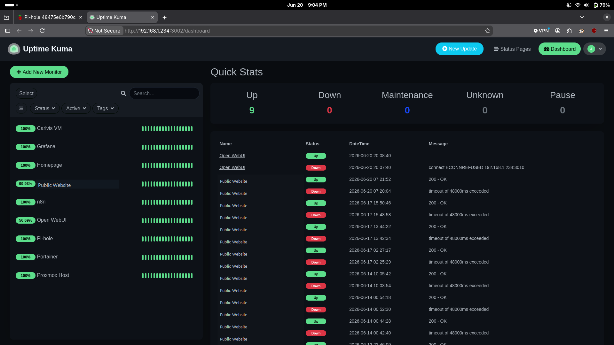

# Project 3: Uptime Kuma Monitoring


## Overview

Deployed Uptime Kuma as a self-hosted uptime monitoring solution running in Docker on the Carlvis VM. Monitors cover both external public-facing websites and internal Carlvis services, giving a single dashboard view of the lab's health.

---

## Goals

- Monitor availability of external websites
- Monitor availability of internal lab services
- Detect outages within 60 seconds
- Establish a baseline for service health before adding more infrastructure
- Practice NOC-style alert triage, service verification, and outage documentation

---

## Support / NOC Relevance

This project demonstrates monitoring and alert-triage tasks used in NOC, Technical Support, Application Support, Cloud Support, and Junior Infrastructure roles:

- Monitoring service availability across internal and external targets
- Choosing the right monitor type for HTTP, TCP, and host reachability checks
- Identifying whether an outage affects one service, one host, or multiple services
- Verifying service health with dashboard status, ports, and host reachability
- Preserving historical outage context for troubleshooting
- Building a foundation for alerting and incident response

---

## Tech Stack

| Component | Role |
|---|---|
| Docker | Container runtime |
| Uptime Kuma | Uptime monitoring |
| Carlvis-Ubuntu (VM 100) | Host on a private LAN |

---

## Screenshots


*Dashboard showing 9 active monitors — all currently up, with historical outage events still visible*

---

## Deployment

Uptime Kuma runs as a Docker container on Carlvis with persistent storage mounted to the host:

```bash
docker run -d \
  --name uptime-kuma \
  --restart always \
  -p 3002:3001 \
  -v /home/big-dog/uptime-kuma-data:/app/data \
  louislam/uptime-kuma:latest
```

**Access:** internal-only endpoint on the private LAN

> Port 3002 is used on the host (instead of the default 3001) to avoid conflicts with other services.

---

## Monitors Configured

### External Websites — HTTP(s)

| Name | URL | Interval |
|---|---|---|
| Public website | Redacted public HTTPS endpoint | 60s |

### Internal Services — TCP Port

TCP Port monitors check that the service port is accepting connections. Used for internal HTTP services since they don't require SSL validation.

| Name | Host | Port | Interval |
|---|---|---|---|
| Grafana | Private VM host | 3000 | 60s |
| Pi-hole | Private VM host | 8080 | 60s |
| Portainer | Private VM host | 9000 | 60s |
| n8n | Private VM host | 5678 | 60s |
| Open WebUI | Private VM host | 3010 | 60s |
| Homepage | Private VM host | 8082 | 60s |

### Infrastructure — Ping

| Name | Host | Interval |
|---|---|---|
| Carlvis VM | Private VM host | 60s |
| Proxmox Host | Private hypervisor host | 60s |

---

## Monitor Types Explained

Uptime Kuma supports several monitor types — choosing the right one matters:

**HTTP(s)** — Makes a full HTTP request and checks the response code. Best for external sites where you want to verify the web server is actually responding, not just that the port is open. Also checks SSL certificate expiration.

**TCP Port** — Opens a TCP connection to a host:port and checks it succeeds. Best for internal services over plain HTTP where SSL isn't involved. Lighter weight than a full HTTP check.

**Ping** — Sends ICMP echo requests. Best for verifying a host is reachable at the network layer, regardless of what services are running.

---

## Results

All 9 monitors were up at the time of capture. Uptime percentages reflect available history, so earlier outages remain visible even after a service recovers.

## Validation Evidence

- Dashboard screenshot shows 9 active monitors
- Mixed monitor types in use: HTTP(s), TCP Port, and Ping
- Internal services, core hosts, and one public endpoint all have live health checks
- Historical outage visibility is preserved for troubleshooting context

| Monitor | Status | Uptime (30-day) |
|---|---|---|
| Carlvis VM | ✅ Up | 100% |
| Grafana | ✅ Up | 100% |
| Homepage | ✅ Up | 100% |
| Public website | ✅ Up | 99.93% |
| n8n | ✅ Up | 100% |
| Open WebUI | ✅ Up | 56.69% |
| Pi-hole | ✅ Up | 100% |
| Portainer | ✅ Up | 100% |
| Proxmox Host | ✅ Up | 100% |

---

## Support Incident Write-Up

- [Incident 001: Monitoring Alert Triage Workflow](./incidents/001-monitoring-alert-triage-workflow.md)

This incident documents the support/NOC-style process for reviewing an outage signal, checking scope, testing service reachability, verifying status, and identifying follow-up actions.

---

## Key Concepts Learned

- **Monitor type selection** — HTTP(s), TCP Port, and Ping serve different purposes; picking the wrong one gives misleading results
- **Port mapping** — Uptime Kuma runs on container port 3001 but is exposed on host port 3002, avoiding conflicts with other services
- **Persistent volumes** — mounting `/app/data` to the host ensures monitor configs and history survive container restarts
- **Self-hosted vs cloud monitoring** — running your own monitoring means no external dependency, but it also means the monitor goes down if the host goes down (a limitation to solve with future redundancy)

---

## What's Next

- Set up notification channels (email or webhook) so outages alert without checking the dashboard
- Add a public Status Page for external services
- As more lab infrastructure is added (Wazuh, Suricata), add monitors here first

---

**Completed:** June 2026
