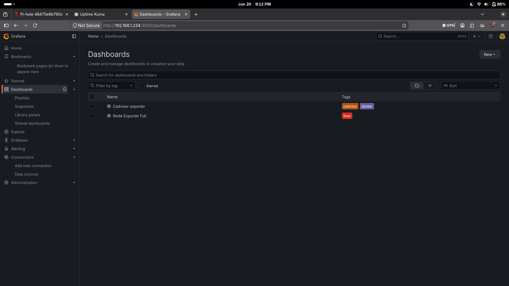
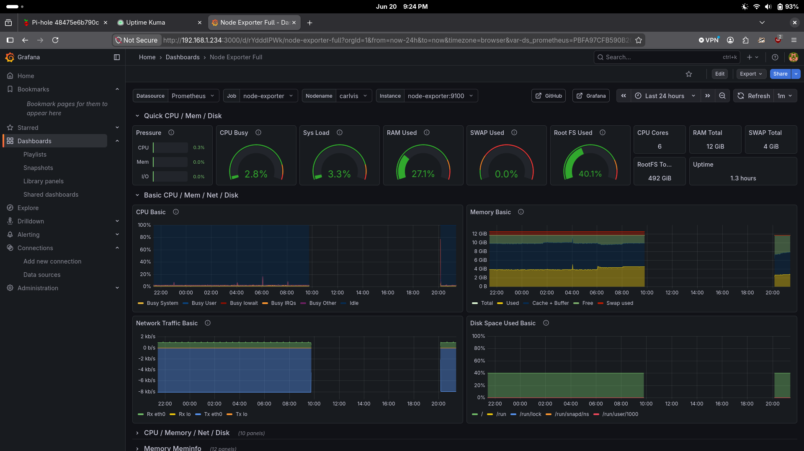

# Project 4: Grafana Monitoring Stack


## Overview

Deployed a full observability stack on Carlvis using Docker. Prometheus scrapes metrics from the host and all running containers, and Grafana visualizes them in real-time dashboards. This gives a single-pane view of CPU, memory, disk, network, and per-container resource usage across the entire VM.

---

## Goals

- Collect host-level metrics (CPU, RAM, disk, network)
- Collect per-container metrics for all Docker workloads
- Visualize metrics in Grafana with pre-built community dashboards
- Understand the metrics pipeline: exporters → Prometheus → Grafana

---

## Screenshots


*Two dashboards configured — cAdvisor (container metrics) and Node Exporter Full (host metrics)*


*Node Exporter Full dashboard showing real-time CPU, memory, network, and disk metrics for Carlvis*

---

## Architecture

```
┌─────────────────────────────────────────────────────┐
│                Carlvis VM (192.168.1.234)            │
│                                                     │
│  ┌─────────────┐    ┌─────────────┐                 │
│  │node-exporter│    │   cAdvisor  │                 │
│  │  :9101      │    │   :8085     │                 │
│  │ host metrics│    │ container   │                 │
│  │             │    │ metrics     │                 │
│  └──────┬──────┘    └──────┬──────┘                 │
│         │                 │                         │
│         └────────┬────────┘                         │
│                  ▼                                   │
│          ┌───────────────┐                          │
│          │  Prometheus   │ ◄── scrapes every 15s    │
│          │    :9090      │                          │
│          └───────┬───────┘                          │
│                  │                                   │
│          ┌───────▼───────┐                          │
│          │    Grafana    │                          │
│          │    :3000      │                          │
│          └───────────────┘                          │
│                                                     │
│          ┌───────────────┐                          │
│          │   InfluxDB    │ ◄── separate time-series │
│          │    :8086      │     data source          │
│          └───────────────┘                          │
└─────────────────────────────────────────────────────┘
```

---

## Tech Stack

| Component | Role |
|---|---|
| Prometheus | Metrics collection and storage |
| Node Exporter | Exposes host OS metrics to Prometheus |
| cAdvisor | Exposes Docker container metrics to Prometheus |
| Grafana | Visualization and dashboards |
| InfluxDB | Secondary time-series data source |
| Docker | Container runtime for all components |

---

## How the Pipeline Works

**Exporters** are lightweight processes that read system state and expose it in a format Prometheus can scrape. There are two running here:

- **Node Exporter** — reads Linux kernel stats (CPU times, memory pages, disk I/O, network bytes) and exposes them at `/metrics` on port 9101. Everything in `/proc` and `/sys` becomes a Prometheus metric.
- **cAdvisor** (Container Advisor) — reads Docker's stats API and exposes per-container resource usage at `/metrics` on port 8085. Every container gets its own labeled metrics.

**Prometheus** polls both exporters every 15 seconds, parses the metrics, and stores them in its local time-series database. It also scrapes itself for internal health metrics.

**Grafana** connects to Prometheus as a data source and runs PromQL queries to build dashboard panels. Community dashboards are pre-built JSON files that wire up the queries automatically — you import by ID and they work immediately.

---

## Deployment

All components run as Docker containers on Carlvis. Prometheus is configured with a `prometheus.yml` file that defines which targets to scrape.

**Access:**
- Grafana: `http://192.168.1.234:3000` (login: admin)
- Prometheus: `http://192.168.1.234:9090`
- Prometheus targets: `http://192.168.1.234:9090/targets`

---

## Dashboards

Two community dashboards imported from [grafana.com](https://grafana.com/grafana/dashboards/):

### Node Exporter Full (ID: 1860)
Host-level metrics for the Carlvis VM. Live readings at time of setup:

| Metric | Value |
|---|---|
| CPU Busy | 3.6% |
| System Load | 9.3% |
| RAM Used | 45.3% of 12 GB |
| Swap Used | 40.2% of 4 GB |
| Root Disk Used | 39.9% of 492 GB |
| CPU Cores | 6 |
| Uptime | 3.3 days |

Sections: Quick CPU/Mem/Disk, CPU Basic, Memory Basic, Network Traffic, Disk Space, and 10+ more collapsible sections.

### cAdvisor Exporter (ID: 14282)
Per-container metrics for all Docker workloads. Containers visible at time of setup:

| Container | Mean CPU | Mean Memory |
|---|---|---|
| cadvisor | 10.1% | 105 MB |
| carlvis-redis | 0.306% | 1.21 MB |
| cloudflared-n8n | 0.208% | 15.5 MB |
| dashboard | 0.128% | 23.6 MB |
| dashboard-api | 0.0599% | 24.3 MB |
| grafana | 0.311% | 77.1 MB |
| hmnp-postgres | 0.00132% | 2.49 MB |
| homepage | 0.193% | 88.6 MB |
| influxdb | — | 35.9 MB |

---

## Prometheus Targets

As of setup, two targets are actively UP:

| Target | Endpoint | Status |
|---|---|---|
| cadvisor | http://cadvisor:8080/metrics | ✅ UP |
| node-exporter | http://node-exporter:9100/metrics | ✅ UP |
| prometheus (self) | http://localhost:9090/metrics | ✅ UP |

Several targets are DOWN due to stale configuration (old pfSense exporter, services using incorrect hostnames). These need to be cleaned up in `prometheus.yml`.

---

## Key Concepts Learned

- **Pull vs push model** — Prometheus *pulls* metrics from exporters on a schedule, unlike some monitoring systems where agents *push* data. This means Prometheus controls the scrape interval and exporters are stateless.
- **Labels** — every metric in Prometheus has key-value labels (e.g. `job="node-exporter"`, `instance="carlvis:9100"`). Labels are how you filter and aggregate across many targets.
- **PromQL** — Prometheus Query Language is used in Grafana panels to select and transform metrics. Community dashboards handle this automatically on import.
- **Exporters as adapters** — node-exporter and cAdvisor are not Prometheus-specific tools; they're adapters that translate system state into the Prometheus exposition format. Any tool that exposes `/metrics` in this format can be scraped.
- **AWS parallel** — this stack mirrors what AWS CloudWatch does natively: collect host/container metrics, store time-series data, visualize in dashboards. The self-hosted version gives hands-on understanding of how the metrics pipeline works under the hood.

---

## What's Next

- Clean up stale Prometheus scrape targets in `prometheus.yml` (remove pfSense, fix broken hostnames)
- Set up Grafana alerting rules to fire when RAM or disk cross thresholds
- When Wazuh is deployed (Project 6), add a Wazuh dashboard here for unified visibility

---

**Completed:** June 2026
