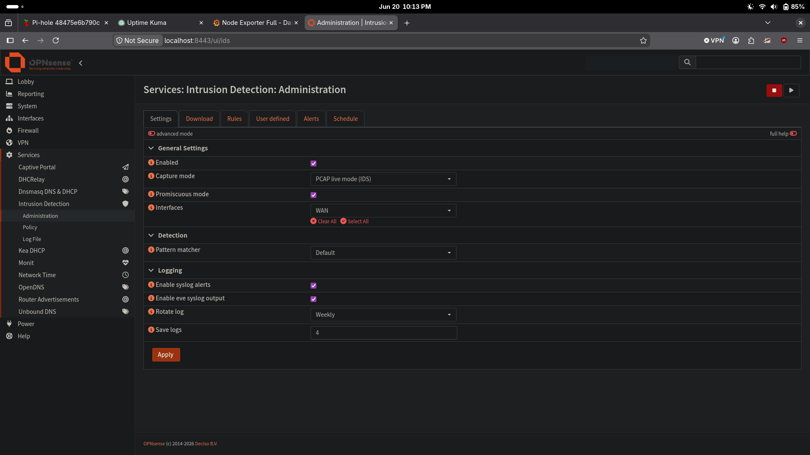
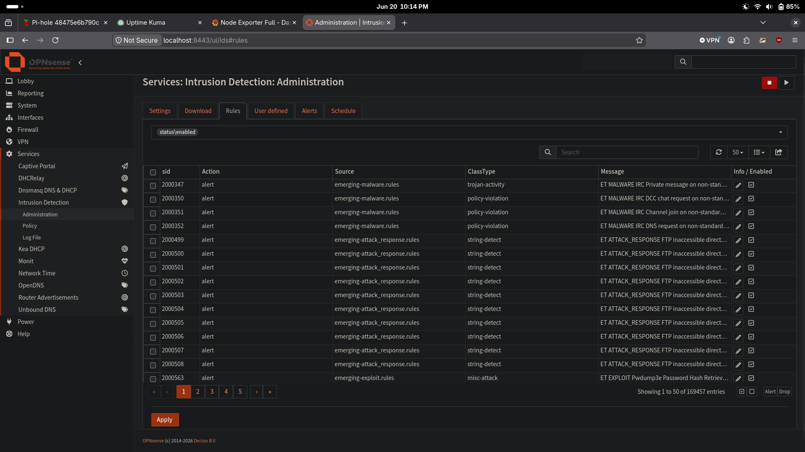

# Project 5: Suricata IDS


## Overview

Deployed Suricata as a network intrusion detection system (IDS) directly on OPNsense. Suricata runs in passive PCAP mode on the WAN interface, inspecting traffic entering and leaving the lab network without dropping packets. Emerging Threats Open rulesets and abuse.ch threat intelligence feeds provide the detection signatures.

This mirrors how enterprise networks use tools like Snort, Suricata, or cloud-native equivalents like AWS GuardDuty — a passive sensor that watches all traffic and alerts on known-bad patterns without blocking anything.

---

## Screenshots


*Suricata configured in PCAP live mode (IDS) on the WAN interface with EVE JSON logging enabled*


*Live alerts firing from Emerging Threats rulesets — real detections from network traffic*

---

## Goals

- Deploy network IDS on the firewall/router (OPNsense)
- Load threat intelligence rulesets for real detection capability
- Understand the difference between IDS and IPS mode
- Establish a detection baseline before Phase 3 (Wazuh SIEM)

---

## Architecture

```
Internet
    │
    ▼
Home Router (192.168.1.254)
    │
    ▼
OPNsense WAN (vtnet0 — 192.168.1.249)
    │
    ├── Suricata (PCAP mode) ←── watches all traffic here
    │       │
    │       └── alerts → /var/log/suricata/eve.json
    │
    ├── LAN  (vtnet1 — 10.10.1.0/24)
    ├── DMZ  (vtnet2 — 10.10.2.0/24)
    └── Lab  (vtnet3 — 10.10.3.0/24)
```

Suricata runs as a child process of OPNsense and listens on `vtnet0` using libpcap. All traffic passing through the WAN interface — inbound from the internet and outbound from all lab segments — is inspected.

---

## Tech Stack

| Component | Version | Role |
|---|---|---|
| OPNsense | 26.1.9 (amd64) | Host — router and firewall |
| Suricata | 8.0.5 | IDS engine |
| Emerging Threats Open | Current | Free community rule sets |
| abuse.ch feeds | Current | Threat intelligence (malware, C2) |

---

## IDS vs IPS

The most important configuration decision in this project:

**IDS (Intrusion Detection System)** — passive. Suricata inspects a copy of each packet via PCAP and generates alerts. Traffic is never modified or dropped.

**IPS (Intrusion Prevention System)** — active. Suricata sits inline (NFQ mode) and can drop packets in real time before they reach the destination.

For this deployment: **IDS mode** was chosen deliberately. Before letting any tool drop legitimate traffic, you first need a baseline of what your network normally generates. Running IDS for a period shows you which rules fire on your traffic patterns — then you can tune before switching to IPS.

Capture mode is set to **PCAP live mode** in OPNsense → Services → Intrusion Detection → Administration → Settings.

---

## Rulesets Enabled

All rulesets sourced from Emerging Threats Open (free) and abuse.ch (free threat intelligence):

| Ruleset | Source | Focus |
|---|---|---|
| abuse.ch/ThreatFox | abuse.ch | Known malware C2 IPs and domains |
| abuse.ch/URLhaus | abuse.ch | Known malware distribution URLs |
| ET open/botcc | Emerging Threats | Botnet command & control IPs |
| ET open/drop | Emerging Threats | Spamhaus DROP list — known bad IP blocks |
| ET open/emerging-attack_response | Emerging Threats | Confirms successful attacks (shell prompts, etc.) |
| ET open/emerging-coinminer | Emerging Threats | Crypto mining malware traffic |
| ET open/emerging-exploit | Emerging Threats | Exploit attempt payloads |
| ET open/emerging-malware | Emerging Threats | General malware signatures |
| ET open/emerging-scan | Emerging Threats | Port scanning and reconnaissance |
| ET open/emerging-shellcode | Emerging Threats | Shellcode in network traffic |
| ET open/emerging-worm | Emerging Threats | Worm propagation traffic |
| ET open/threatview_CS_c2 | Emerging Threats | Additional C2 server detection |

**Why not all rulesets?** OPNsense runs on a 2 GB RAM VM. Loading every available ruleset would exhaust memory. The selected set covers the highest-value categories — active exploitation, malware callbacks, and threat intelligence feeds — while leaving out noisy low-priority categories (chat, games, file sharing).

---

## Deployment

Suricata is built into OPNsense — no plugin installation required. Configuration via:

**Services → Intrusion Detection → Administration**

Settings applied:
- Enabled: yes
- Capture mode: PCAP live mode (IDS)
- Promiscuous mode: enabled
- Interface: WAN (vtnet0)
- Syslog alerts: enabled
- EVE syslog output: enabled (JSON format — required for future Wazuh integration)

Rulesets downloaded and enabled via the **Download** tab. OPNsense stores rules at:

```
/usr/local/etc/suricata/opnsense.rules/
```

The rule manifest is managed in `/usr/local/etc/suricata/installed_rules.yaml` which OPNsense generates automatically when rules are enabled and downloaded.

---

## Verification

Confirm Suricata is running and which interface it's on:

```bash
ssh <opnsense-admin>@192.168.1.249 "ps aux | grep suricata"
# Expected: suricata -D --pcap=vtnet0 --pidfile /var/run/suricata.pid ...
```

Confirm rule files are present:

```bash
ssh <opnsense-admin>@192.168.1.249 "ls /usr/local/etc/suricata/opnsense.rules/*.rules"
```

Check live traffic events in EVE JSON log:

```bash
ssh <opnsense-admin>@192.168.1.249 "tail -5 /var/log/suricata/eve.json"
```

Check for any alerts:

```bash
ssh <opnsense-admin>@192.168.1.249 "grep '\"event_type\":\"alert\"' /var/log/suricata/eve.json | wc -l"
```

---

## Viewing Alerts

OPNsense WebGUI (via SSH tunnel):

```bash
ssh -L 8443:127.0.0.1:443 <opnsense-admin>@192.168.1.249
# then: https://127.0.0.1:8443
```

Navigate to **Services → Intrusion Detection → Administration → Alerts**

Alert fields: Timestamp, SID, Action, Interface, Source IP, Source Port, Destination IP, Destination Port, Alert message.

---

## Key Concepts Learned

- **IDS vs IPS** — detection (passive) vs prevention (active inline). IDS first to understand baseline, then tune before enabling IPS.
- **PCAP mode** — Suricata receives a copy of each packet via libpcap. The firewall still processes the original; Suricata just observes.
- **Rulesets are signatures** — each rule has a SID (Signature ID), a message string, content patterns, and protocol/port matchers. Suricata evaluates every packet against loaded rules.
- **Flowbits** — a mechanism for multi-step detection. Rule A sets a flowbit when it sees a suspicious pattern; Rule B fires only if that flowbit is set AND it sees a follow-up pattern. This reduces false positives.
- **EVE JSON format** — Suricata's structured logging format. All events (flows, DNS, HTTP, alerts) written as JSON to `eve.json`. This is the standard input format for SIEMs like Wazuh or Elastic.
- **AWS parallel** — Suricata in IDS mode mirrors AWS GuardDuty: passive analysis of network traffic against threat intelligence feeds, generating findings without blocking. The difference is GuardDuty analyzes VPC Flow Logs after the fact; Suricata inspects live packets.

---

## What's Next

- Monitor Alerts tab over time to understand baseline traffic patterns
- When alerts appear, use SID numbers to look up rule details on `rules.emergingthreats.net`
- **Project 6: Wazuh SIEM** — ship `eve.json` alerts to Wazuh for centralized correlation and dashboards. The EVE JSON output enabled here is the integration point.
- Switch to IPS mode (NFQ) after establishing a clean baseline with no false positives

---

**Completed:** June 2026
